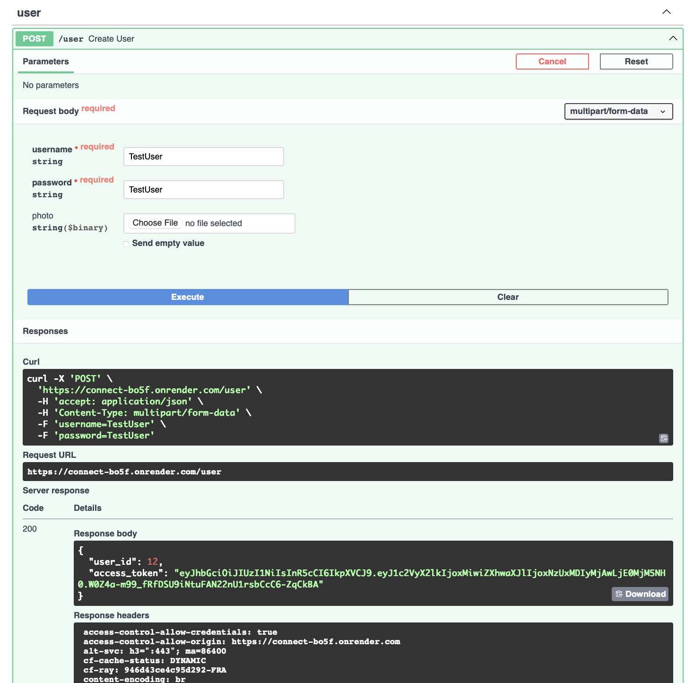
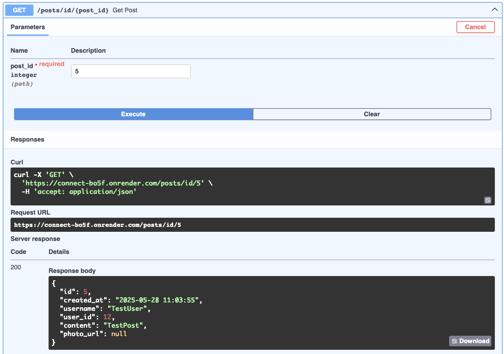
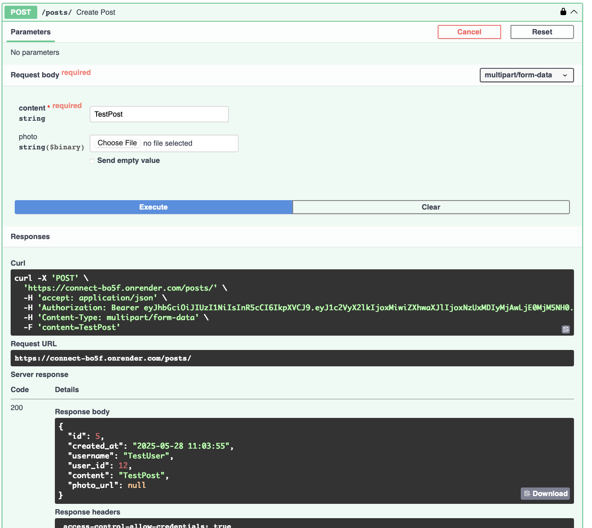
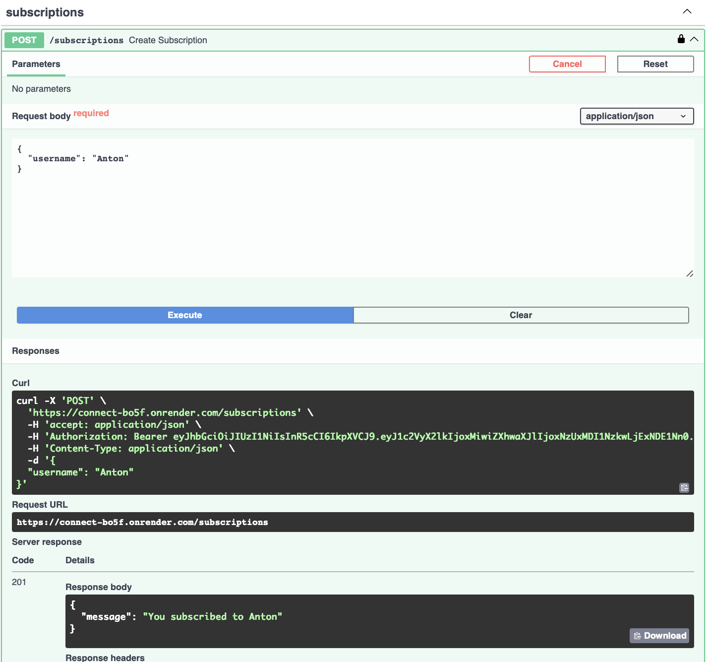
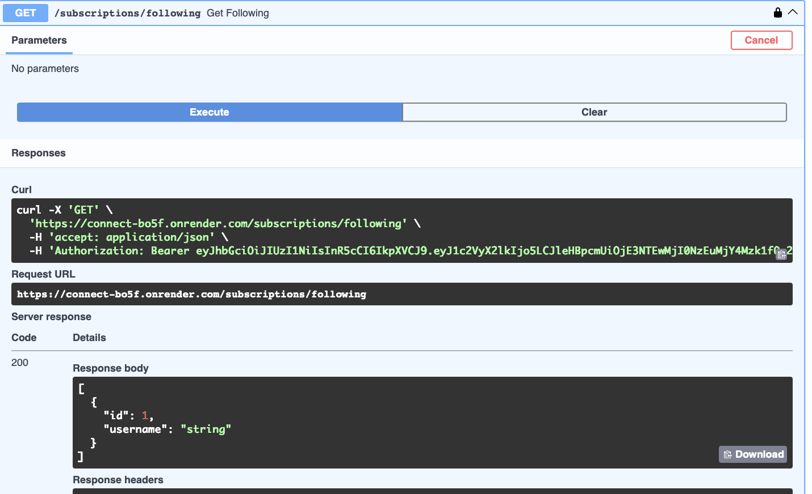
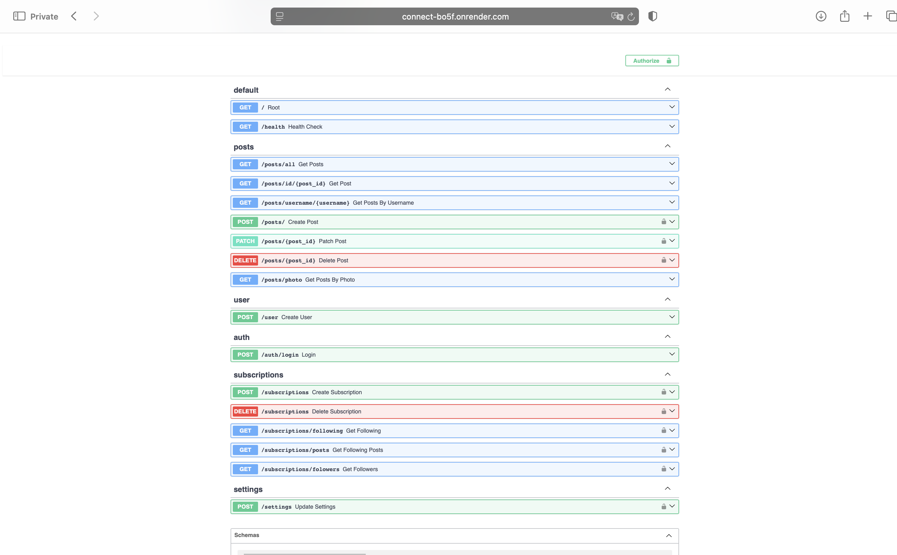

# 🚀 Connect - Modern Social Platform API

<div align="center">


 Yandex.Disk

</div>

## 🌟 Overview

Connect is a powerful, scalable, and modern social platform API built with FastAPI. It provides a robust foundation for building social networking applications with features like user management, content sharing, and real-time interactions.

## ✨ Key Features

- 🔐 **Secure Authentication System**
  - JWT-based authentication
  - Role-based access control
  - Secure password hashing

- 👥 **User Management**
  - User profiles
  - User settings
  - Subscription management
  - Social connections

- 📝 **Content Management**
  - Post creation and management
  - Rich media support
  - Content moderation

- 🔄 **Real-time Features**
  - Asynchronous processing with Celery
  - Background task management
  - Event-driven architecture

- 🛡️ **Security & Monitoring**
  - Sentry integration for error tracking
  - CORS middleware
  - Comprehensive logging
  - Rate limiting

- 💾 **Yandex.Disk Integration**
  - File storage and management
  - Automatic file synchronization
  - Secure file sharing

## 🛠️ Technology Stack

- **Backend Framework**: FastAPI
- **Database**: PostgreSQL
- **Cache**: Redis
- **Task Queue**: Celery
- **Containerization**: Docker
- **Testing**: Pytest
- **Code Quality**: Ruff, Flake8

## 🚀 Getting Started

### Prerequisites

- Docker and Docker Compose
- Python 3.12+
- Make (optional, for using Makefile commands)

### Quick Start

1. Clone the repository:
```bash
git clone https://github.com/PinGBin74/connect.git
cd connect
```

2. Set up environment variables:
```bash
cp .local.env.example .local.env
```

3. Start the application:
```bash
docker-compose up -d
```

The API will be available at `http://localhost:8080`

### Development Setup

1. Create a virtual environment:
```bash
python -m venv .venv
source .venv/bin/activate  # On Windows: .venv\Scripts\activate
```

2. Install dependencies:
```bash
poetry install 
```

3. Run the development server:
```bash
make run
```

## 🛠️ Available Make Commands

The project includes several useful make commands to simplify development:

```bash
make run              # Run the application with uvicorn (host: 127.0.0.1, port: 8080)
make start-celery-beat    # Start Celery beat scheduler
make start-celery-worker  # Start Celery worker
make migrate-create MIGRATION="<message>"  # Create a new database migration
make migrate-apply  # Apply pending database migrations
make help          # Show all available commands
```

## 📚 API Documentation

Once the application is running, you can access:
- Swagger UI: `http://localhost:8080/docs`
- ReDoc: `http://localhost:8080/redoc`

## 🧪 Testing

Run the test suite:
```bash
pytest test
```

## 🐳 Docker Support

The project includes Docker configuration for easy deployment:

- `Dockerfile` - Main application container
- `docker-compose.yml` - Development environment
- `docker-compose.test.yml` - Testing environment

## 📦 Project Structure

```
connect/
├── app/
│   ├── users/                    # User management
│   │   ├── auth/                # Authentication
│   │   ├── user_profile/        # User profiles
│   │   ├── subscription/        # Subscription management
│   │   └── users_settings/      # User settings
│   │
│   ├── posts/                   # Content management
│   │   ├── handlers/           # API endpoints
│   │   ├── models/             # Database models
│   │   └── services/           # Business logic
│   │
│   ├── infrastructure/          # Core infrastructure
│   │   ├── celery/             # Celery configuration
│   │   ├── database/           # Database setup
│   │   └── redis/              # Redis configuration
│   │
│   ├── yandex_disk/            # Yandex.Disk integration
│   │   ├── handlers/           # API endpoints
│   │   ├── models/             # Data models
│   │   └── services/           # Yandex.Disk API integration
│   │
│   ├── main.py                 # Application entry point
│   ├── settings.py             # Application settings
│   └── dependecy.py            # Dependency injection
│
├── infra/                       # Infrastructure configuration
│   ├── Dockerfile              # Main application Dockerfile
│   ├── docker-compose.yml      # Docker services configuration
│   └── .dockerignore           # Docker build context exclusions
│
├── tests/                      # Test suite
└── makefile                    # Development commands
```

## 🤝 Contributing

1. Fork the repository
2. Create your feature branch (`git checkout -b feature/amazing-feature`)
3. Commit your changes (`git commit -m 'Add amazing feature'`)
4. Push to the branch (`git push origin feature/amazing-feature`)
5. Open a Pull Request


## 🌐 Demo and Documentation

### Live Demo on Render

The application is deployed on Render and available at: [https://connect-bo5f.onrender.com](https://connect-bo5f.onrender.com)

- **Swagger UI**: [https://connect-bo5f.onrender.com/docs](https://connect-bo5f.onrender.com/docs)
- **Database will expire on:** June 26, 2025

### Main API Endpoints

- **User**
  - `POST /user` — Register a new user (username, password, photo)
    
    
    *Example: Creating a user via the /user endpoint*

- **Auth**
  - `POST /auth/login` — User login

- **Posts**
  - `GET /posts/all` — Get all posts
  - `GET /posts/id/{post_id}` — Get post by ID
    
    
    *Example: Retrieving a post by its ID*
  - `GET /posts/username/{username}` — Get posts by username
  - `POST /posts/` — Create a post (content, photo)
    
    
    *Example: Creating a post via the /posts/ endpoint*
  - `PATCH /posts/{post_id}` — Update a post
  - `DELETE /posts/{post_id}` — Delete a post
  - `GET /posts/photo` — Get posts by photo

- **Subscriptions**
  - `POST /subscriptions` — Subscribe to a user
    
    
    *Example: Subscribing to a user*
  - `DELETE /subscriptions` — Unsubscribe
  - `GET /subscriptions/following` — Get following list
    
    
    *Example: Getting the list of users you follow*
  - `GET /subscriptions/posts` — Get posts from subscriptions
  - `GET /subscriptions/followers` — Get followers

- **Settings**
  - `POST /settings` — Update user settings

### What's on the Screenshots

- **Swagger UI** — Full list of available API endpoints, grouped by category (user, posts, subscriptions, auth, settings).

  
  *Example: Swagger UI overview of all endpoints*

All examples in the screenshots are from the real deployment on Render. Use the Swagger UI link above to test the endpoints yourself.

---

In the Technology Stack section above, please note:
- **PostgreSQL** is used as the main database.
- **Redis** is used for caching and background task management.

## 👥 Authors

- Anton Fayfer
